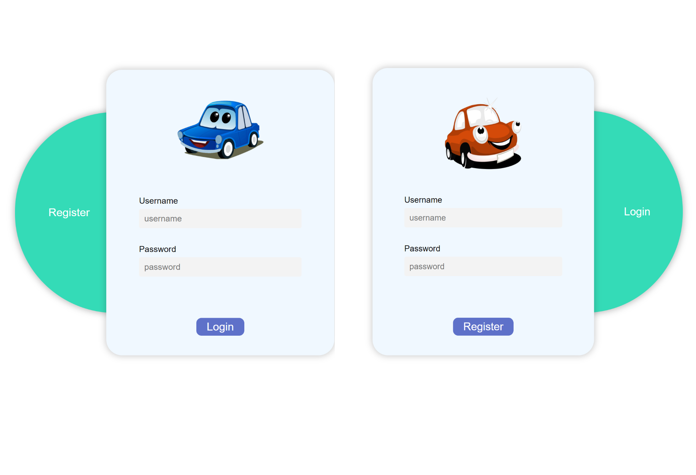
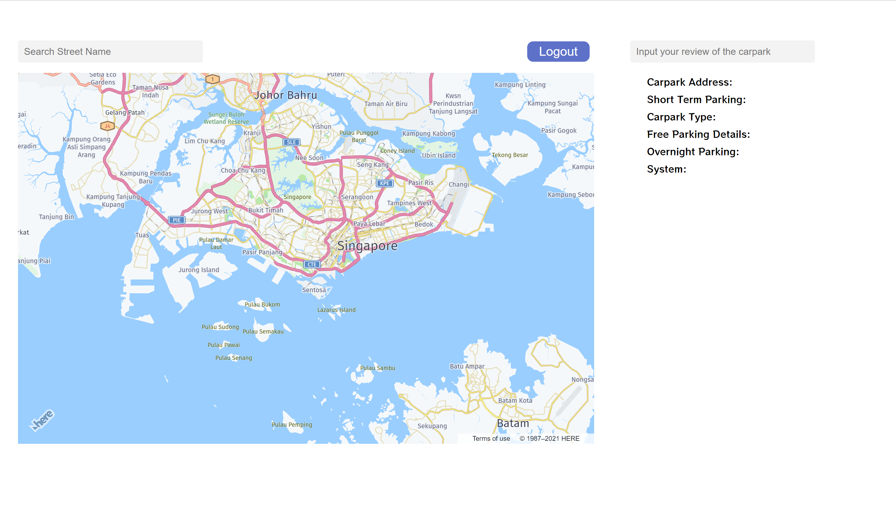
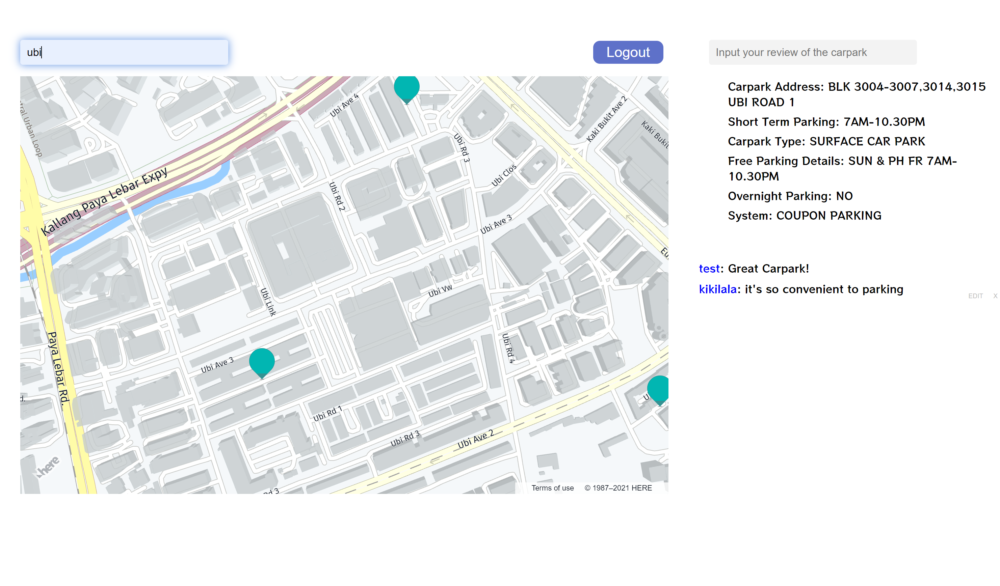
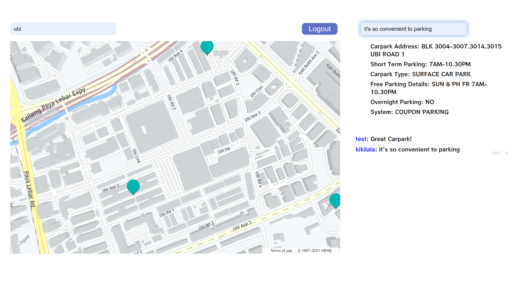
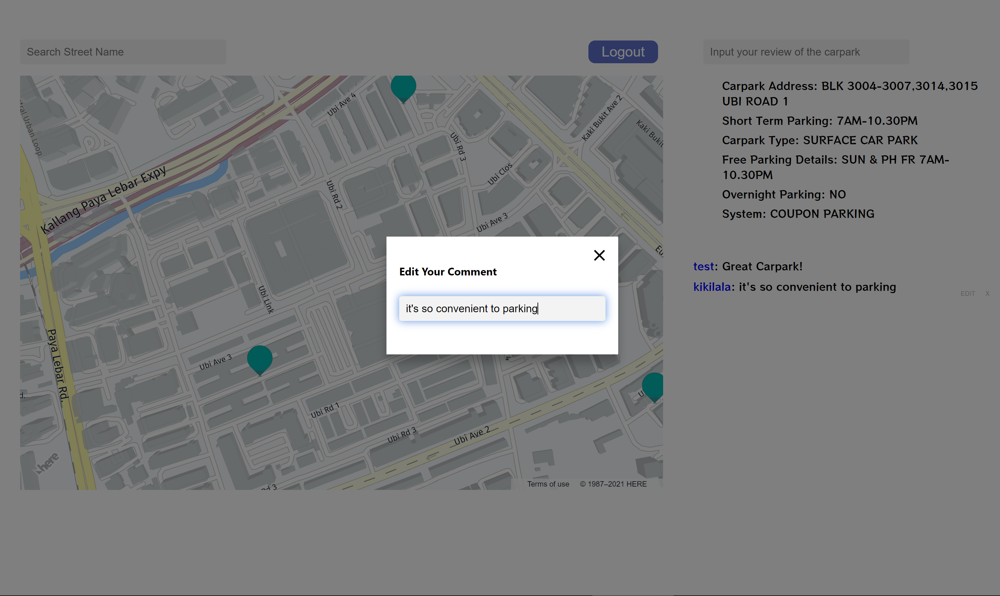
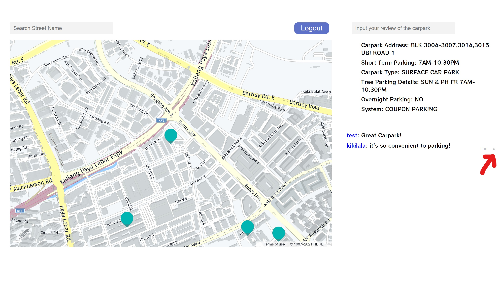

# GA-Carpark-Finder

## Link

https://parkit-sg.herokuapp.com/

## Database/Storage

- #### MongoDB
- #### Heroku

## Technologies

- #### Jsx
- #### Method-override
- #### Bycript
- #### Express-session
- #### Express
- #### Mongoose
- #### Nodemon
- #### Path
- #### Dotevn
- #### Moments
- #### cors

## RESTful router

| **No.** | **Route** | **URL**    | **HTTP Verb** | **Description** |
| ------- | --------- | ---------- | ------------- | --------------- |
| 1.      | Read      | / carpark  | GET           | Read carpark    |
|         |           | / comment  | GET           | Read comments   |
|         |           | / register | GET           |                 |
| 2.      | Create    | / carpark  | POST          |                 |
|         |           | / comment  | POST          | create comments |
|         |           | / register | POST          | Register form   |
|         |           | / login    | POST          | Login form      |
| 3.      | Update    | / carpark  | PUT           |                 |
|         |           | / comment  | PUT           | Edit comments   |
|         |           | / register | PUT           |                 |
| 4.      | Destroy   | / carpark  | DELETE        |                 |
|         |           | / comment  | DELETE        | Delete comments |
|         |           | / register | DELETE        | Logout form     |
|         |           | / login    | DELETE        | Logout form     |

## Accomplishments

-

## Wireframe Design

- Register or Login Page.

- after login will show the main page of car park finder.

- The User can seach the parking location.

- After the user has experience with the parking location, the user can give a feedback about the parking location.

- After the user has give feedback about the car park location and the user can edit his or her comments.

- Users also can delete the comment by click on the "X" button.

## Additional Features were under Considerations
