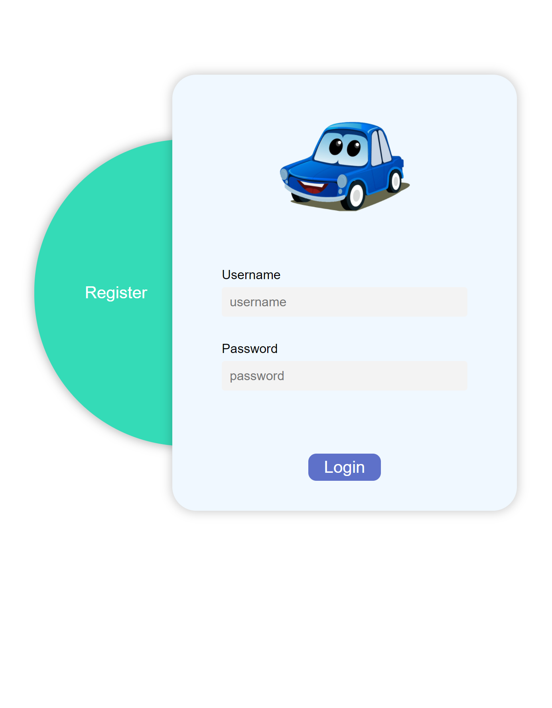
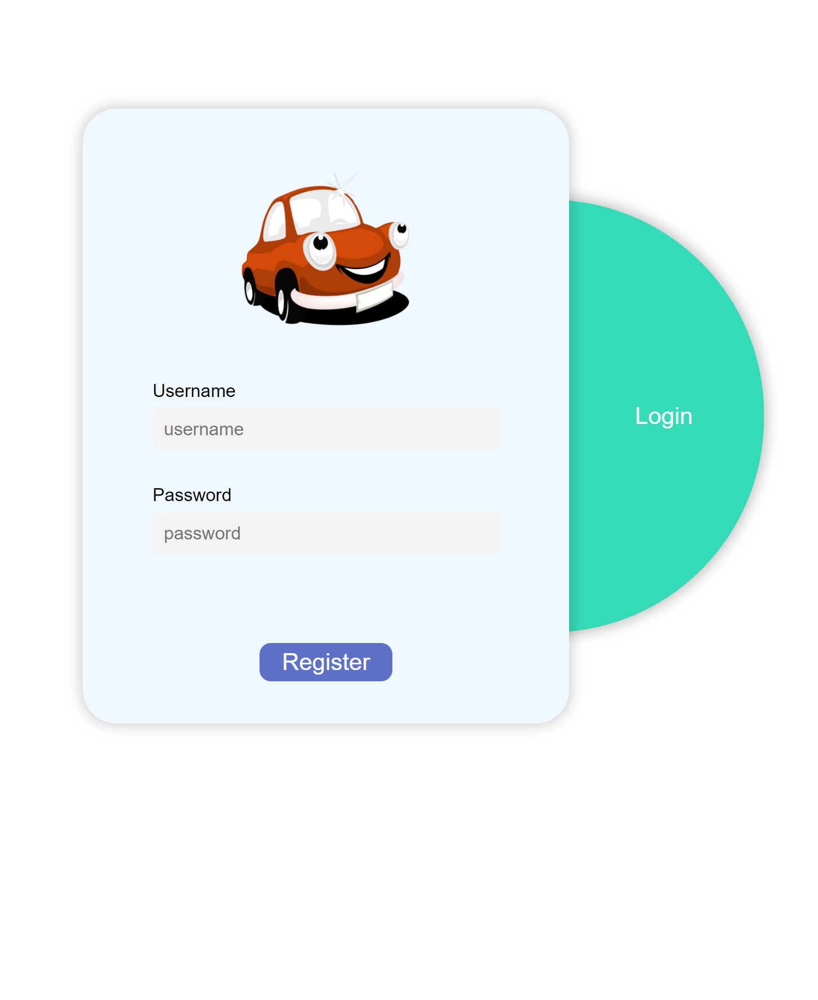

# GA-Carpark-Finder

## Link
https://parkit-sg.herokuapp.com/

## Database/Storage

- #### MongoDB
- #### Heroku

## Technologies

- #### Jsx
- #### Method-override
- #### Bycript
- #### Express-session
- #### Express
- #### Mongoose
- #### Nodemon
- #### Body-Parser
- #### Dotevn
- #### Moments
- #### cors

## RESTful router

| **No.** | **Route** | **URL** | **HTTP Verb** | **Description** |
| ------- | --------- | ------- | ------------- | --------------- |
| 1.      | Index     | /       | GET           |                 |
|         |           | /       | GET           |                 |
| 2.      | New       | /       | GET           |                 |
|         |           | /       | GET           |                 |
|         |           | /       | GET           |                 |
| 3.      | Create    | /       | POST          |                 |
|         |           | /       | POST          |                 |
|         |           | /       | POST          |                 |
| 4.      | Show      | /       | GET           |                 |
| 5.      | Edit      | /       | GET           |                 |
| 6.      | Update    | /       | PUT           |                 |
|         |           | /       | PUT           |                 |
| 7.      | Destroy   | /       | DELETE        |                 |
|         |           | /       | DELETE        |                 |

## Accomplishments

-

## Wireframe Design
 
- Register or Login Page.

- after login will show the main page of car park finder.

- The User can seach the parking location.

- After the user has experience with the parking location, the user can give a feedback about the parking location.

- After the user has give feedback about the car park location and the user can edit his or her comments.

- Users also can delete the comment by click on the "X" button.

## Additional Features were under Considerations