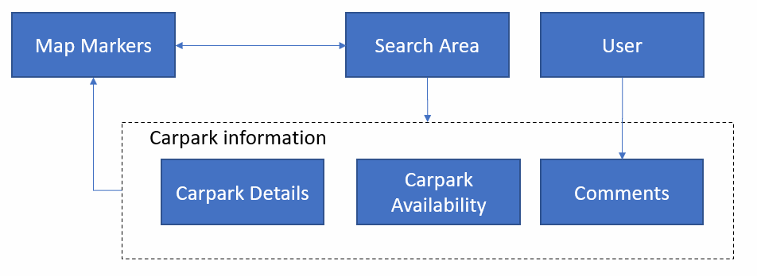

# GA-Carpark-Finder
This application allows users to search for real-time available carpark slots at a destination of your choice in Singapore

## Link

- App: https://parkit-sg.herokuapp.com/

- Daily tracker: https://trello.com/b/xim7UBDY/parkit-sg

## Database/Storage

- #### MongoDB
- #### Heroku

## Technologies

- Jsx
- Method-override
- Bycript
- Express-session
- Express
- Mongoose
- Nodemon
- Path
- Dotevn
- Moments
- Cors

## RESTful router

| **No.** | **Route** | **URL**    | **HTTP Verb** | **Description** |
| ------- | --------- | ---------- | ------------- | --------------- |
| 1.      | Read      | / carpark  | GET           | Read carpark    |
|         |           | / comment  | GET           | Read comments   |
|         |           | / register | GET           |                 |
| 2.      | Create    | / carpark  | POST          |                 |
|         |           | / comment  | POST          | create comments |
|         |           | / register | POST          | Register form   |
|         |           | / login    | POST          | Login form      |
| 3.      | Update    | / carpark  | PUT           |                 |
|         |           | / comment  | PUT           | Edit comments   |
|         |           | / register | PUT           |                 |
| 4.      | Destroy   | / carpark  | DELETE        |                 |
|         |           | / comment  | DELETE        | Delete comments |
|         |           | / register | DELETE        | Logout form     |
|         |           | / login    | DELETE        | Logout form     |

## Data-flow relationship

## Accomplishments

- User need to register and login to the GA carpark finder app. When the user successful login to the carpark finder app. The carpark finder app will show the map and detail. user type the name of the carpark location by click search. The map will show the location and carpark detail with user comments. User can see the review by clicking the carpark location name. User can share their experience to the specific carpark and give the comment to the carpark. User also can edit his or her comment just click on edit button. how ever user can delete the comment if his or her post to wrong carpark. User is not able to edit or delete other user comments. User will logout after finish using the app.

## Wireframe Design

- Click on Register button will swicth to register page. after register user click on Login button will swicth to login page.
  

- After the user login successful will show the main page of car park finder.
  

- The User can search the parking location by typing the location name.
  

- After the user has experience with the parking location, the user can give a feedback about the parking location.
  

- After the user has give feedback about the car park location and the user can edit his or her comments.
  

- Users also can delete the comment by click on the "X" button.
  

## Additional Features that were under Considerations
- separate front end repo with back end repo
- include smart search
- specify a box area that the map will automatically "zoom" to, so that it will show all the markers on the map.

## Known bugs
- The active session is not saved, upon refresh state will be gone. To prevent app from crashing, the login component will appear again for user to re-login.
- For initial-login, users might encounter 503 services unavailable error.
